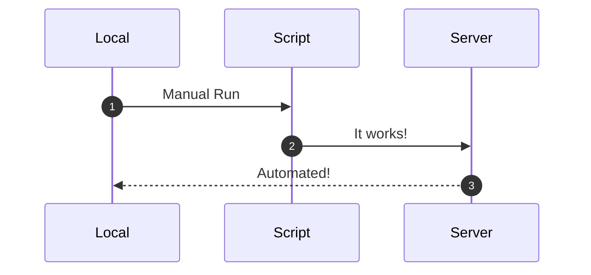
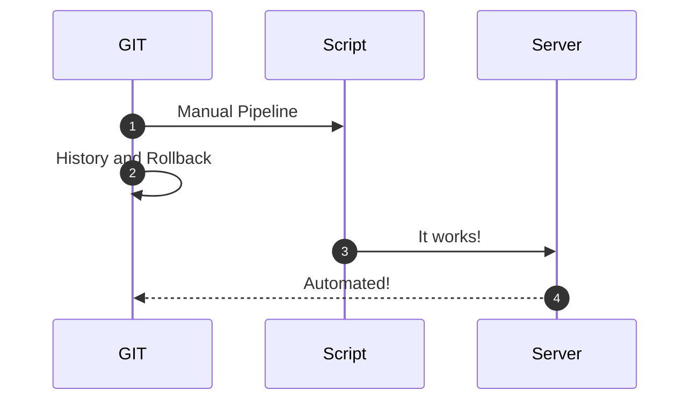
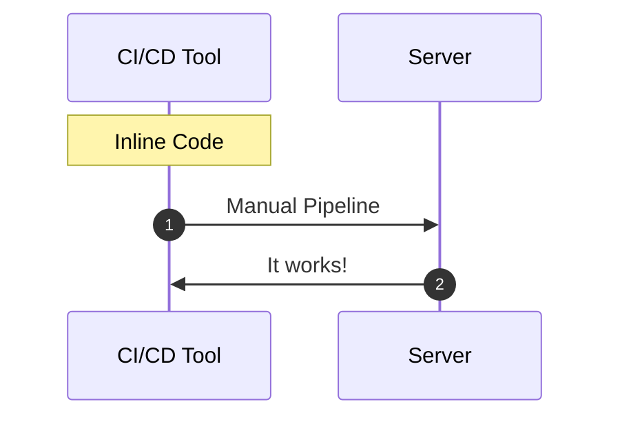
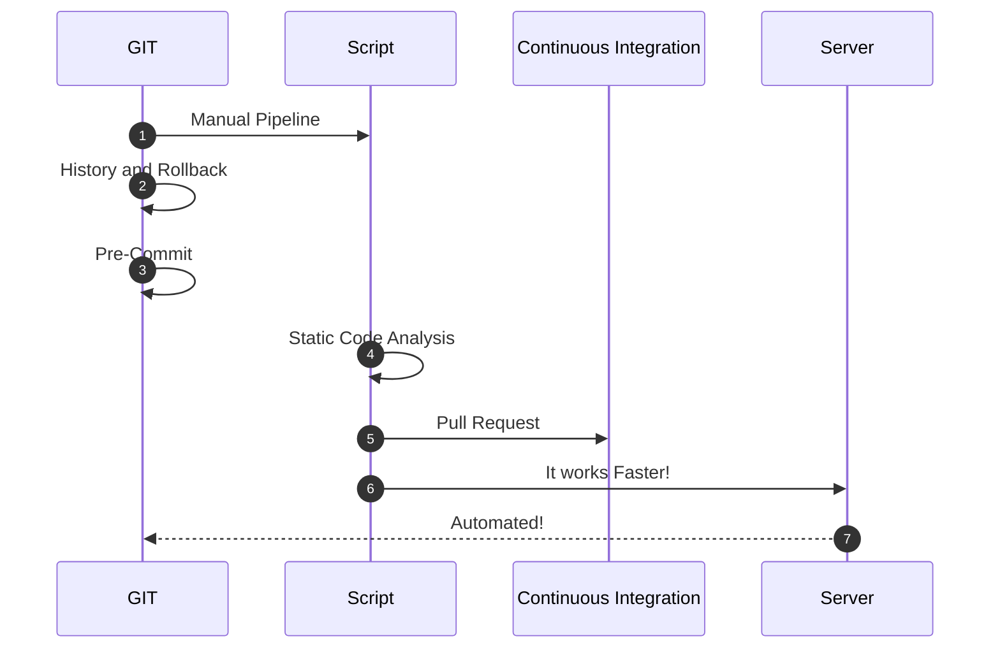
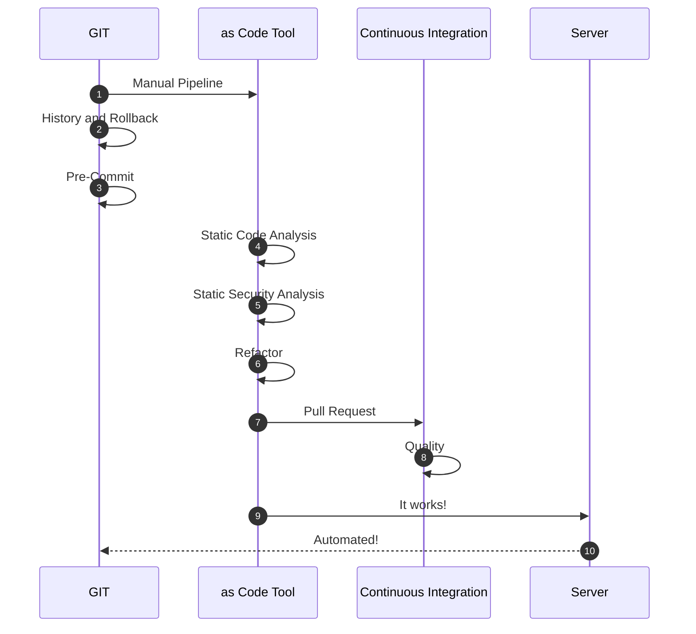
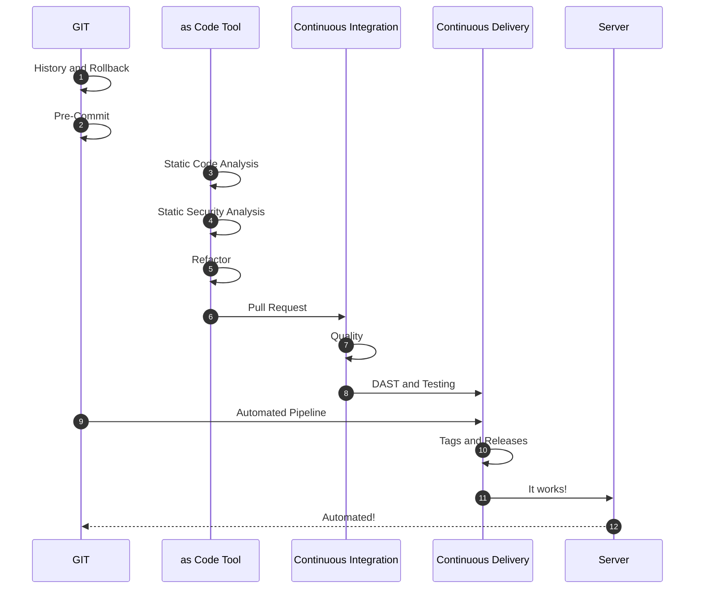
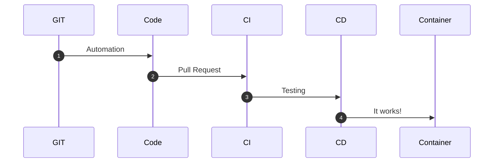

# From Local Scripts to Continuos Deployment - My Experience and Vision

## Introduction - Fail Fast and Teams

Many teams try to implement automated deployment for their applications or Cloud components. Most of them fall in the same hole: **Fail Fast** and **Confidence**.

Different reasons prevent a **Grow Mindset**:

* Non-sense strict deadlines
* Lack of confidence
* Complain of Failure
* Judging performance
* Lack of innovation

### “Ever tried. Ever failed. No matter. Try Again. Fail again. Fail better.” - Samuel Beckett

Automation requires time to start, creativity, investigation, and innovation. Failing fast is part of the learning process.

Check if the implemented process is *optimal and scalable*. Investigate alternative solutions and improvements. With the right mindset to *refactor* the process and the code, every team will reach its full potential.

## From Human Intervention to Full Automation

Let's define a possible timeline of how could be the trip from a manual run to a fully automated process.

### The first stage - Fear of losing a job

When a new technology knocks on the door, multiple reasons are stopping a Team to progress on innovation and new techniques adoption.

* The *damned* comfort zone
* Lost one's job
* False sense of control

But don't worry, with the right coaching and time, teams will gain confidence and will improve the above procedure.

With these feelings over the table, and other external factors, the best approach could be:

It works, and it is automated but there is still some field for improvement.

### The second stage - Starting the Dunning-Kruger Effect

This is a wonderful stage, where the team starts to gain confidence and is pretty damn sure they know a whole lot. At this stage, the automation starts to grow and the team starts to learn new techniques. They use *git* and *pipelines*.

It seems similar to the *first stage* but not in the least. The process is:

* Centralized in a Git repository.
* Runnable by anyone in the team.
* It has a history log.
* It can be rolled back and traced.

#### Using a CI/CD Tool with inline code

> **Warning!!!**
>
> Having all the logic in the pipeline or using graphical options is not recommended.
>
>It is not scalable, has a lot of dependency on the CI/CD tool, and doen't offer the advantages like rollbacks, traces, and logging given the *"as code"* options.
>
>It could be something like:

### The third stage - Questioning our current solution

Hosting our code to Git is taking a firm step in the way of automation.

The curiosity starts to open new ways of working with Git like *Git Hooks*. The team discovers how to apply Continuous Integration in their code. The original scripts could be custom *Bash*, *Python*, or *Powershell* and use *ShellCheck*, *PyLint*, or *PSScriptAnalyzer* respectively. The **Pre-Commit**, **Static Analysis**, and **Pull Requests** have arrived to stay.

### The fourth stage - Realizing there is a long way to go

With Continuous Integration, the process changes dramatically. The teams start to look for new automation techniques and think about changing their scripts for standard tools like *Terraform*, *Pulumi*, *Ansible*, or *Chef* among others. Using a tool like *Terraform* doesn't mean that the team will improve its process. Compared with using Bash, the *Terraform* code is just another script launched from the local machine.

**Speed** is becoming an important asset and, the referred external tools help to achieve it. Most of these tools are prepared to run different jobs in parallel.

**Security** is key and with standard tools, it is possible to do **Static Security Analysis** before running the deployments.

**Refactoring** is a new word and it becomes part of the process. The team knows that is time to review and learn.

*Git* is now the standard and the Pull Request Process is improving. The team starts to implement other testing and quality gates before the approvals.

### The fifth stage - The Grown-Up Mountain

**Continuous Delivery** and other techniques are now knocking on the door. The Team is out of its comfort zone and starts to investigate and learn new ways of improving. Probably is too early for Continuous Deployment.

**Tags** and **releases** are part of the process as well as creating **artifacts** and pushing to the respective servers.

**Documentation as code**, **Containers**, **Dynamic Security**, and **Integration Testing** is part of the improvement plan.

The diagram is now bigger with lots of components. The process is becoming better and better:

### The sixth stage - Plateau of Productivity

In this stage, **GitOps**, **APIs**, **WebHooks**, **Trunk Based**, or **Containers** are part of the game. But also **Observability**, **Chaos Testing**, **Continuous Deployment**, or **Canary and Blue-Green** deployments among others.

The whole process can be summarized like:

## Summary

Hitting excellence is the result given by the confidence gained by the Team during the whole process but also from the business.

Investing time in new ways of working and techniques is key to continue improving. Getting out of our comfort zone, discussing and applying our learning to our everyday job are symbols of a well-balanced team.
