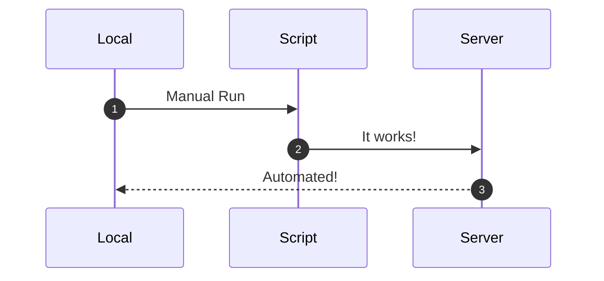
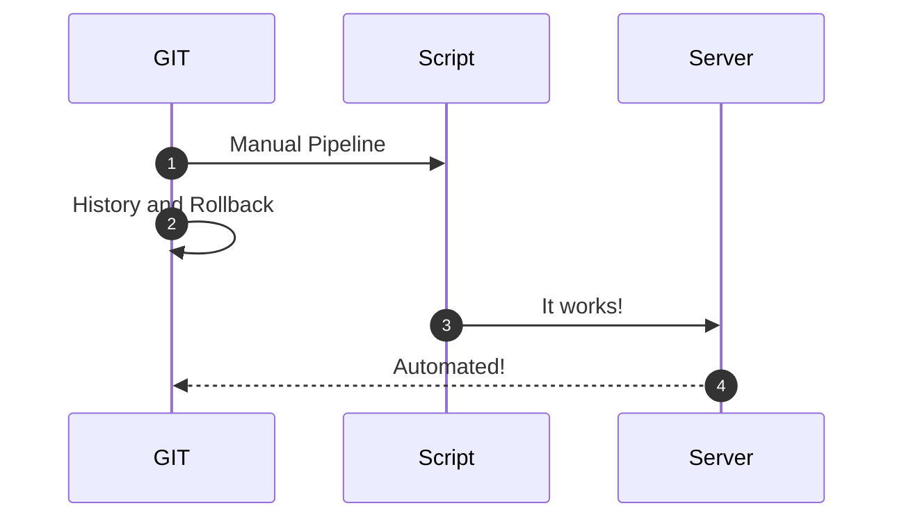
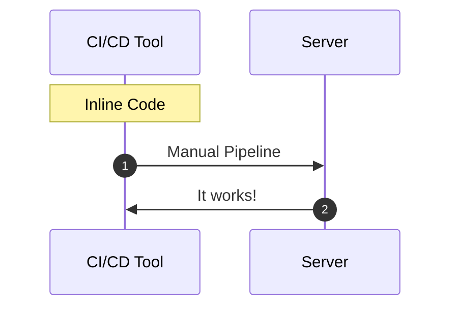
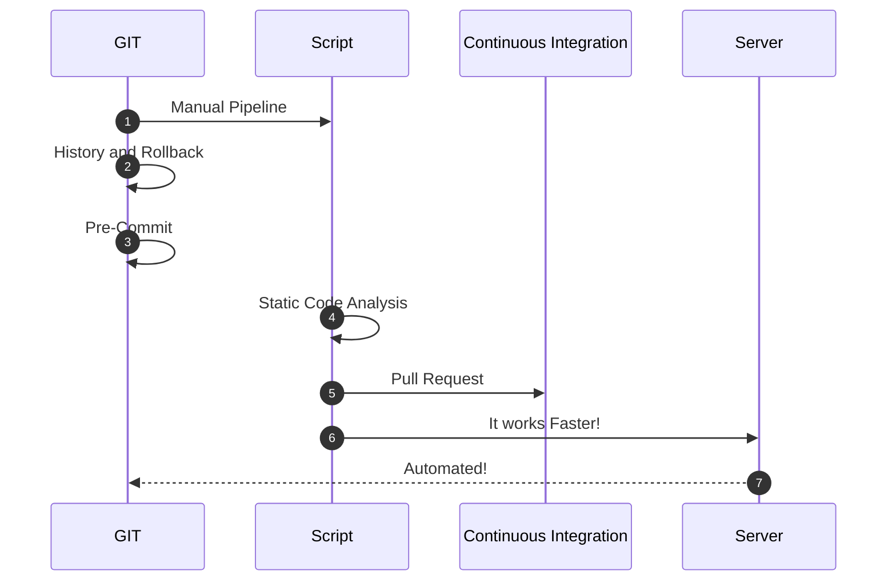
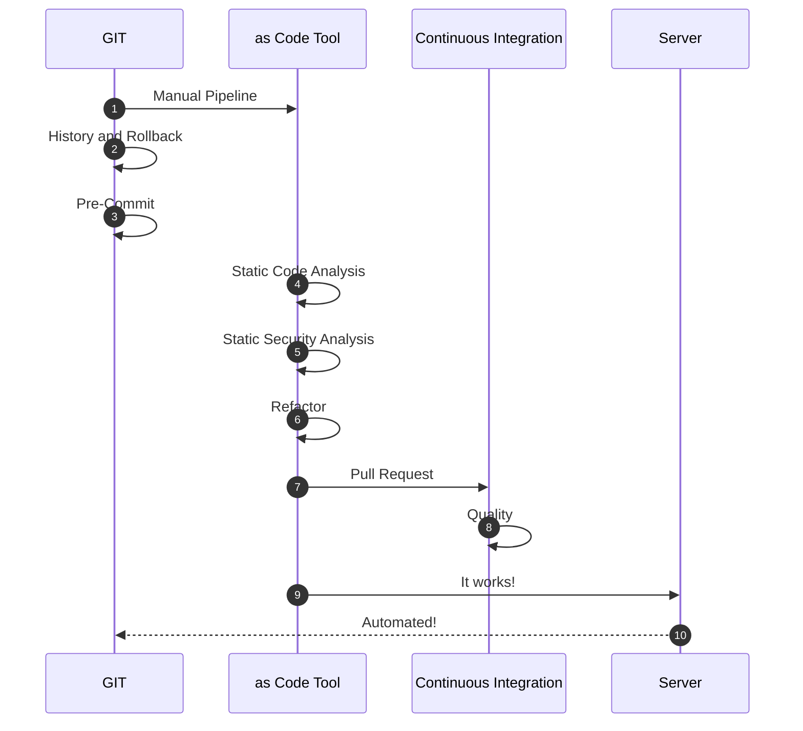
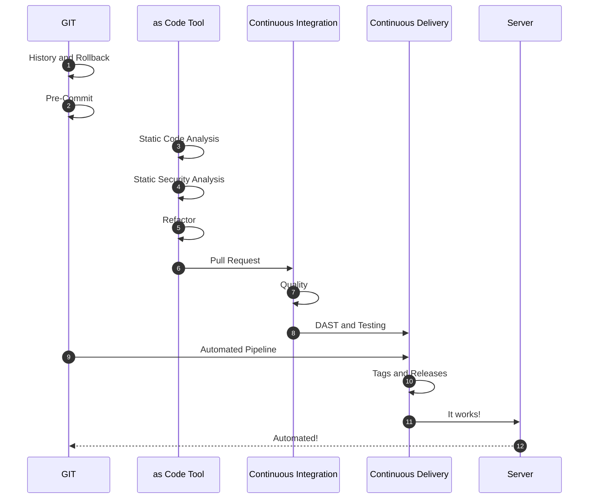
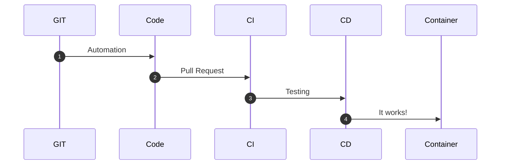

# From Local Scripts to Continuos Deployment

## Introduction - Fail Fast and Teams

Many Teams try to implement automated deployment for their applications or Cloud components. Most of them fall in the same hole: **Fail Fast** and **Confidence**.

Different reasons prevent a **Grow Mindset**:

* Non-sense strict deadlines
* Lack of confidence
* Complain of Failure
* Judging performance
* Lack of innovation

### Ever tried. Ever failed. No matter. Try Again. Fail again. Fail better. - Samuel Beckett

Automation requires time to start, creativity, investigation, and innovation. Failing fast is part of the learning process.

Check if the implemented process is *optimal and scalable*. Investigate alternative solutions and improvements. With the right mindset to *refactor* the process and the code, every Team will reach its full potential.

## From Human Intervention to Full Automation

Let's define a possible timeline of how could be the process from a manual run to a fully automated procedure.

### The first stage - Fear of losing a job

When a new technology knocks on the door, multiple reasons could stop a Team from progressing on innovation and adopting new techniques.

* The *damned* comfort zone
* Lost one's job
* False sense of control

Having the right coaching and time, Teams will gain confidence and improve the above procedure.

With these feelings over the table and other external factors, the best approach could be:

It works and is automated. But there is still some field for improvement.

### The second stage - Starting the Dunning-Kruger Effect

At this stage, the Team starts to gain confidence and is pretty damn sure they know a lot. Automation starts to grow, and the Team initiates to learn new techniques. They use *GIT* and *pipelines*.

It seems similar to the *first stage*, but not in the least. The process is:

* Centralized in a GIT repository.
* Runnable by anyone on the Team.
* It has a history log.
* It can be rolled back and traced.

#### Using a CI/CD Tool with inline code

> **Warning!!!**
>
> Having all the logic in the pipeline or using graphical options is not recommended.
>
>It is not scalable, has a lot of dependency on the CI/CD tool, and doesn't offer the advantages like rollbacks, traces, and logging given the *"as code"* options.
>
>It could be something like:

### The third stage - Questioning our existing implementation

Hosting the code in GIT is a further important step towards automation.

Curiosity opens new ways of working with GIT, like *GIT Hooks*. The Team discovers how to apply Continuous Integration in their code. The original scripts could be custom *Bash*, *Python*, or *Powershell* and use *ShellCheck*, *PyLint*, or *PSScriptAnalyzer*. The **Pre-Commit**, **Static Analysis**, and **Pull Requests** have arrived to stay.

Check if the automation in place fits with the following rules:

* Can Create new components
* Can Modify existing components
* Can Remove existing components

In this stage, thoughts about recovery speed and rolling back in case of disaster emerge.

### The fourth stage - Realizing there is still a long way to go

With Continuous Integration, the process changes dramatically. The Teams start to look for new automation techniques and think about changing their scripts for standard tools like *Terraform*, *Pulumi*, *Ansible*, or *Chef*, among others. Using a tool like *Terraform* doesn't mean the Team will improve its process. Compared with Bash, the *Terraform* code is just another script launched from the local machine.

**Speed** is becoming an important asset, and the referred external tools help to achieve it. Most of these tools are prepared to run different jobs in parallel.

**Security** is key to automation, and with standard tools, it is possible to do **Static Security Analysis** before running the deployments.

**Refactoring** is a new word and becomes part of the process. The Team realizes it is time to review the existing implementation and learn from previous mistakes.

*GIT* is now the standard, and the Pull Request Process is improving. The Team starts to implement other testing and quality gates before the approvals.

### The fifth stage - The Grown-Up Mountain

**Continuous Delivery** and other techniques are now knocking on the door. The Team is out of its comfort zone and starts to investigate and learn new ways of improving. Probably, it is too early for Continuous Deployment.

**Tags** and **releases** are part of the process, just as creating **artifacts** and pushing to the respective servers.

**Documentation as code**, **Containers**, **Dynamic Security**, and **Integration Testing** is part of the improvement plan.

**Makefiles** facilitate self-documentation and serve as a startup point for all the implementations.

The diagram is now larger with lots of components. The process is becoming better and better:

Everything should be modular and repeatable now. As examples:

* Jinja2 Templates
* Code generation Templates
* Golang Templates
* CookieCutter
* Modules, Roles, Providers, or Packages in Terraform, Ansible, and Pulumi

### The sixth stage - Plateau of Productivity

In this stage, **GITOps**, **APIs**, **WebHooks**, **Trunk Based**, or **Containers** are part of the game. But also **Observability**, **Chaos Testing**, **Continuous Deployment**, or **Canary and Blue-Green** deployments, among others.

The whole process can be summarized like this:

## Summary

Hitting excellence is the result given by the confidence gained by the Team during the whole process, but also from the business.

Investing time in new ways of working and techniques is essential to continue improving. Getting out of our comfort zone, discussing and applying our learning to our job are symbols of a well-balanced Team.
