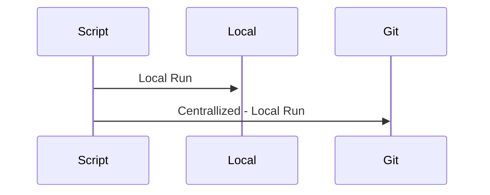

# From Local Scripts to Continuos Deployment - My Experience and Vision

## Introduction - Fail Fast and Teams

Many teams try to implement automated deployment for their applications or their Cloud components but most of them fall in the same hole: **Fail Fast** and consequently, **Confidence**.

There are different reasons that prevent a **Grow Mindset**, just the typical examples:

* Non-sense strict timelines
* Lack of confidence
* Complain of Failure
* Judging performance
* Lack of innovation

### “Ever tried. Ever failed. No matter. Try Again. Fail again. Fail better.” - Samuel Beckett

Automation requires time to start, creativity, investigation and innovation. Failing fast is part of the learning process.

Think if the implemented process is *optimal and scalable*. Investigate for alternative solutions and improvements. With the right mindset to *refactor* the process and the code, every team will reach to their full potential.

