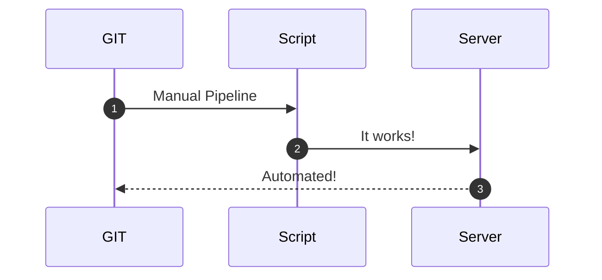

# From Local Scripts to Continuos Deployment - My Experience and Vision

## Introduction - Fail Fast and Teams

Many teams try to implement automated deployment for their applications or their Cloud components but most of them fall in the same hole: **Fail Fast** and consequently, **Confidence**.

There are different reasons that prevent a **Grow Mindset**, just the typical examples:

* Non-sense strict deadlines
* Lack of confidence
* Complain of Failure
* Judging performance
* Lack of innovation

### “Ever tried. Ever failed. No matter. Try Again. Fail again. Fail better.” - Samuel Beckett

Automation requires time to start, creativity, investigation and innovation. Failing fast is part of the learning process.

Think if the implemented process is *optimal and scalable*. Investigate for alternative solutions and improvements. With the right mindset to *refactor* the process and the code, every team will reach to their full potential.

## From Human Intervention to Full Automation

Let's define a possible timeline of how it could be the trip from manual run to a full automated process.

### The first stage - Fear of losing job

When a new technology knocks to the door, there are multiple reasons stopping a Team to progress on innovation and new techniques adoption.

* The *damned* comfort zone
* Lost one's job
* False sense of control

But don't worry, with the right coaching and time, teams will gain confidence and will improve aboves procedure.

With aboves feelings over the table, and other external factors, the best approach could be:

It works, and it is automated but there is still some field for improvement.

### The second stage - Starting the Dunning-Kruger Effect

This is a wonderful stage, where the team start to gain confidence and is pretty damn sure they know a whole lot. On this stage, the automation starts to grow and the team starts to learn new techniques. They use *git* and *pipelines*.

It seems similar to the *first stage* but not in the least. The process is now in a central repository and runnable by anyone in the team. There is a commit history.

I have found the first and a half stage, where the having all the logic in the pipeline. This is probably the biggest error a team can perform. It is not scalable at all and it has a lot of dependency on the CI/CD Tool.
