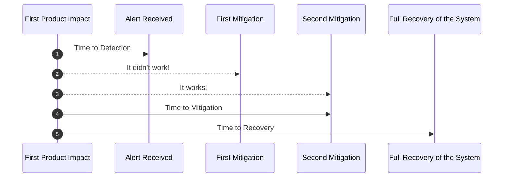

# SRE Metrics

| Name                      | Metric Measured                                                                                | Common Usage                                           |
|---------------------------|------------------------------------------------------------------------------------------------|--------------------------------------------------------|
| Mean time to detect       | Time between an issue appearing in the system and an alert being issued for it                 | Improve Monitoring Systems                             |
| Mean time to acknlowledge | Time between an issue being detected and someone beginning to work on it                       | Improve Alerting Systems                               |
| Mean time to recover      | Time between an issue causing a disruption and the service returning to previous functionality | Improving backup systems and other contingency plans   |
| Mean time to repair       | Time between noticing an issue and fixing technical problems causing it                        | Improving efficiency of bug fixing and troubleshooting |
| Mean time to resolve      | Time between an issue occurring andthe entire incident being concluded                         | Improving end -to-end incident response procedures     |

