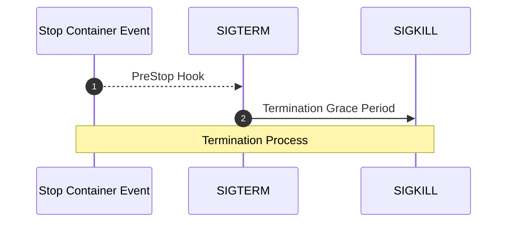

# Kubernetes *Pods* Stuck in Terminating: A Resolution Guide

Do you know why a *Pod* takes too much time to get deleted or even hangs on the `Terminating` state?

This post describes the *Pod* Lifecycle conditions, reasons why they could hang in the `Terminating` state, and some tips to get rid of them.

## *Pod* Termination

There are multiple reasons why the Kubernetes Scheduler can evict a healthy container. For example, the execution of *Pods* with higher priority, the drain of a node during a version update, an auto-scaling process, a [resource bin-packing](https://kubernetes.io/docs/concepts/scheduling-eviction/resource-bin-packing/), or a simple `kubectl delete` command.

Kubernetes provides graceful termination for not needed *Pods* with [Container Lifecycle Hooks](https://kubernetes.io/docs/concepts/containers/container-lifecycle-hooks/#container-hooks). They are executed by the kubelet on the specific containers when it receives the event.



When Kubelet knows that a *Pod* should evict, it marks the *Pod* state as `Terminating` and stops sending traffic to it. Then, it executes the `preStop` lifecycle hook (when available). It sends the `SIGTERM` to the Main process (pid 1) within each container and waits for their termination. If the applications inside the containers are properly prepared, they will start a graceful shutdown. The duration should not be more than the specified in the [spec.terminationGracePeriodSeconds](https://kubernetes.io/docs/reference/generated/kubernetes-api/v1.21/#podspec-v1-core) which is 30 seconds by default.

If the application has not completed the shutdown properly, the Kubelet gives a grace period, until removing the *Pod* IP and killing the container by sending a `SIGKILL`. At this point, Kubernetes removes the *Pod* from the API server.

## Why a *Pod* can hang on `Terminating` state

The most common reasons for a *Pod* hanging during the eviction process are:

* A *Finalizer* dependency
* An incorrect `terminationGracePeriodSeconds` value

### Finalizers

From [Kubernetes documentation](https://kubernetes.io/docs/concepts/overview/working-with-objects/finalizers/):

> Finalizers are namespaced keys that tell Kubernetes to wait until specific conditions are met before it fully deletes resources marked for deletion.

*Finalizers* are used to prevent the accidental deletion of resources. When a *Pod* hangs in the Terminating state, check its `metadata/finalizers`.

For instance, this example has a **Kubernetes** key as a *finalizer* used for namespaces.

```yaml
kind: Pod
metadata:
  finalizers:
    - kubernetes
spec:
  containers:
```

Upon attempting to delete the pod:

```sh
kubectl delete pod/mypod &
```

Kubernetes will report back that it has been deleted:

```sh
kubectl get pod/mypod -o yaml
```

What happened is that the object was updated, not deleted. The *Pod* gets modified to include the deletion timestamp keeping it in the `Terminating` state.

```yaml
  creationTimestamp: "2023-01-28T15:01:32Z"
  deletionGracePeriodSeconds: 0
  deletionTimestamp: "2023-01-28T15:01:44Z"
  finalizers:
  - kubernetes
status:
    state:
      terminated:
        containerID: containerd://b6298f7ee5613b717000bb5a54cf96e70f7f0cb8dd8e1c3c5f9d115b0fbfc7c9
        exitCode: 0
        finishedAt: "2023-01-28T15:01:44Z"
        reason: Completed
        startedAt: "2023-01-28T15:01:33Z"
```

### The PreStop hook and terminationGracePeriodSeconds

From the [Kubernetes Documentation](https://kubernetes.io/docs/concepts/containers/container-lifecycle-hooks/#hook-handler-execution):

> If a `PreStop` hook hangs during execution, the Pod's phase will be `Terminating` and remain there until the *Pod* is killed after its `terminationGracePeriodSeconds` expires.

For instance. This configuration:

```yaml
spec:
  terminationGracePeriodSeconds: 3600
  containers:
    - lifecycle:
        preStop:
        exec:
          command:
            - /bin/sh
            - -c
            - sleep 3600
```

Will keep the *Pod* in the `Terminating` state for 1 hour.

It is essential to handle the `SIGTERM` correctly and ensure that the application terminates gracefully when the kubelet sends the `SIGTERM` to the container.

## Remove Finalizers

Determine if the cause of the `Terminating` state for a Pod, *Namespace*, or *PVC* is a *finalizer*. A [Finalizer](https://kubernetes.io/blog/2021/12/15/kubernetes-1-23-prevent-persistentvolume-leaks-when-deleting-out-of-order/) example to protect PVCs from deletion is the `kubernetes.io/pvc-protection`.

If we want to delete the *Pod*, we can simply patch it on the command line to remove the *finalizers*:

```sh
kubectl patch pod/mypod --type=json -p '[{"op": "remove", "path": "/metadata/finalizers" }]'
```

or

```sh
kubectl patch pod/mypod -p '{"metadata":{"finalizers":null}}'
```

Once the *finalizer* list is empty, the object can be reclaimed by Kubernetes and put into a queue to be deleted from the registry.

## Force Delete the POD

As explained in the [Kubernetes Documentation](https://kubernetes.io/docs/tasks/run-application/force-delete-stateful-set-pod/#force-deletion), force deletions **do not** wait for confirmation from the kubelet that the *Pod* has been Terminated. Use it with care and as a workaround solution:

```sh
kubectl delete pod/mypod --grace-period=0 --force
```

## Extra Tip: Finalizers blocking Kubernetes upgrade

One or many of your Cluster node resources or availability can cause [Pod eviction](https://kubernetes.io/docs/concepts/scheduling-eviction/node-pressure-eviction/).

>The kubelet monitors resources like memory, disk space, and filesystem inodes on your cluster's nodes. When one or more of these resources reach specific consumption levels, the kubelet can proactively fail one or more *Pods* on the node to reclaim resources and prevent starvation.

During a cluster upgrade check your node drain:

```sh
kubectl get nodes
```

```sh
NAME       STATUS                     ROLES           AGE   VERSION
cluster    Ready,SchedulingDisabled   control-plane   12m   v1.26.1
```

Review the status of your *Pods* with:

```sh
kubectl get *Pods* -A
```

```sh
NAMESPACE     NAME                                      READY   STATUS        RESTARTS   AGE
default       mypod                                     0/1     Terminating   0          5m42s
kube-system   etcd-minikube                             1/1     Running       0          14m
kube-system   kube-apiserver-minikube                   1/1     Running       0          14m
kube-system   kube-controller-manager-minikube          1/1     Running       0          14m
kube-system   kube-proxy-5dwnf                          1/1     Running       0          14m
kube-system   kube-scheduler-minikube                   1/1     Running       0          14m
```

Check *Pod* *finalizer* as usual:

```sh
kubectl get pod/mypod -o yaml
```

```yaml
apiVersion: v1
kind: Pod
metadata:
  creationTimestamp: "2023-01-29T14:12:38Z"
  deletionGracePeriodSeconds: 0
  deletionTimestamp: "2023-01-29T14:13:28Z"
  finalizers:
  - kubernetes
```

And patch when needed:

```sh
kubectl patch pod/mypod -p '{"metadata":{"finalizers":null}}'
```

## Conclusion

If you find any Kubernetes component stuck on `Termination` review if any component *finalizer* is protecting its deletion, whether for a *Pod*, *PVC*, or *Namespace*.

A good example to remember is the instructions to uninstall the `KEDA` operator for a Kubernetes cluster [here](https://keda.sh/docs/2.9/deploy/#uninstall) where the scaledobjects can interfere with its *Namespace* deletion.
