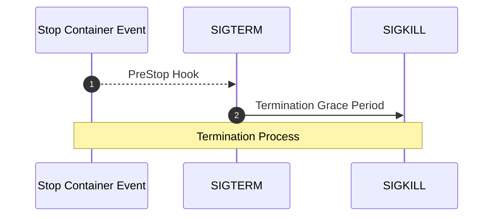

# Kubernetes Pods Stuck in Terminating: A Resolution Guide

Do you know why a Pod takes too much time to get deleted or even hangs on `Terminating` state?

This post describes the Pod Lifecycle conditions, reasons of why they could hang on `Terminating` state, and some useful tips to get rid of them.

## Pod Termination

There are multiple reasons why the Kubernetes Scheduler can evict a healthy container. For example, the execution of Pods with higher priority, the drain of a node during a version update, an auto-scaling process, a [resource bin-packing](https://kubernetes.io/docs/concepts/scheduling-eviction/resource-bin-packing/) or a simple `kubectl delete` command.

Kubernetes provides for graceful termination when Pods are no longer needed with [Container Lifecycle Hooks](https://kubernetes.io/docs/concepts/containers/container-lifecycle-hooks/#container-hooks). They are executed by the kubelet on the specific containers when it receives the event.



When kubelet knows that a pod should be terminated, it marks the Pod state as `Terminating` and stops sending traffic to the Pod. Then, it executes the `preStop` lifecycle hook (if exists). It sends the `SIGTERM` to the main process (pid 1) within each container in the pod and waits for their termination. If the applications inside the containers are properly prepared, they will start a graceful shutdown. The duration should not be more than the specified in the [spec.terminationGracePeriodSeconds](https://kubernetes.io/docs/reference/generated/kubernetes-api/v1.21/#podspec-v1-core) which is 30 seconds by default.

If the application hasn't completed the shutdown properly, the Kubelet gives a grace period, until removing the pod IP and killing the container by sending a `SIGKILL`. At this point, Kubernetes removes the Pod from the API server.

## Why a Pod can hang on `Terminating` state

The most common reasons for a pod hanging during the eviction process are:

* A `Finalizer` dependency
* An incorrect `terminationGracePeriodSeconds` value

### Finalizers

From [Kubernetes documentation](https://kubernetes.io/docs/concepts/overview/working-with-objects/finalizers/):

> Finalizers are namespaced keys that tell Kubernetes to wait until specific conditions are met before it fully deletes resources marked for deletion.

**Finalizers** are used to prevent accidental deletion of resources. If a pod is stuck on Terminating state check the `metadata/finalizers` of the pod.

For instance, this example has a `kubernetes` key as `finalizer` normally used on namespaces.

```yaml
kind: Pod
metadata:
  finalizers:
    - kubernetes
spec:
  containers:
```

Upon attempting to delete the pod:

```sh
kubectl delete pod/mypod &
```

Kubernetes will report back that it has been deleted:

```sh
kubectl get pod/mypod -o yaml
```

What’s happened is that the object was updated, not deleted. The Pod has been modified to include the deletion timestamp keeping it on `Terminating` state.

```yaml
  creationTimestamp: "2023-01-28T15:01:32Z"
  deletionGracePeriodSeconds: 0
  deletionTimestamp: "2023-01-28T15:01:44Z"
  finalizers:
  - kubernetes
status:
    state:
      terminated:
        containerID: containerd://b6298f7ee5613b717000bb5a54cf96e70f7f0cb8dd8e1c3c5f9d115b0fbfc7c9
        exitCode: 0
        finishedAt: "2023-01-28T15:01:44Z"
        reason: Completed
        startedAt: "2023-01-28T15:01:33Z"
```

### The PreStop hook and terminationGracePeriodSeconds

From the [Kubernetes Documentation](https://kubernetes.io/docs/concepts/containers/container-lifecycle-hooks/#hook-handler-execution):

> If a `PreStop` hook hangs during execution, the Pod's phase will be `Terminating` and remain there until the Pod is killed after its `terminationGracePeriodSeconds` expires.

For instance. This configuration:

```yaml
spec:
  terminationGracePeriodSeconds: 3600
  containers:
    - lifecycle:
        preStop:
        exec:
          command:
            - /bin/sh
            - -c
            - sleep 3600
```

Will keep our pod on `Terminating` state for 1 hour.

It is essential to handle the `SIGTERM` correctly and ensure that the application terminates gracefully when the kubelet sends the `SIGTERM` to the container.

## Remove Finalizers

Determine if the cause of the `Terminating` state for a Pod, namespace or PVC for instance is a finalizer. Think that PVC for instance can be protected for deletion with the `kubernetes.io/pvc-protection` [Finalizer](https://kubernetes.io/blog/2021/12/15/kubernetes-1-23-prevent-persistentvolume-leaks-when-deleting-out-of-order/).

If we want to delete the pod, we can simply patch it on the command line to remove the `finalizers`:

```sh
kubectl patch pod/nginx --type=json -p '[{"op": "remove", "path": "/metadata/finalizers" }]'
```

Once the finalizer list is empty, the object can actually be reclaimed by Kubernetes and put into a queue to be deleted from the registry.

## Force Delete the POD
