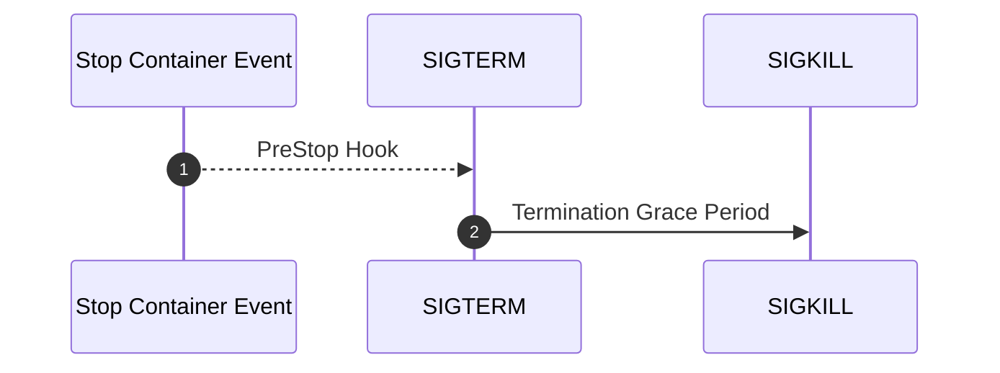

# Kubernetes Pods Stuck in Terminating: A Resolution Guide

Do you know why a Pod takes too much time to get deleted or even hangs on `Terminating` state?

This post describes the Pod Lifecycle conditions, reasons of why they could hang on `Terminating` state, and some useful tips to get rid of them.

## Pod Termination

There are multiple reasons why the Kubernetes Scheduler can evict a healthy container. For example, the execution of Pods with higher priority, the drain of a node during a version update, an auto-scaling process, a [resource bin-packing](https://kubernetes.io/docs/concepts/scheduling-eviction/resource-bin-packing/) or a simple `kubectl delete` command.

Kubernetes provides for graceful termination when Pods are no longer needed with [Container Lifecycle Hooks](https://kubernetes.io/docs/concepts/containers/container-lifecycle-hooks/#container-hooks) which are executed by the kubelet on the specific containers when it receives the event.



When kubelet knows that a pod should be terminated, before sending the `SIGTERM` to the container, it executes the `preStop` lifecycle hook if exists and waits for the termination of the container. The duration should not be more than the specified in the [spec.terminationGracePeriodSeconds](https://kubernetes.io/docs/reference/generated/kubernetes-api/v1.21/#podspec-v1-core), which is 30 seconds by default.

Kubelet gives a grace period until removing the pod IP and then kills the container by sending a `SIGKILL`.

## Why a Pod can hang on `Terminating` state

The two most common reasons are a long `terminationGracePeriodSeconds` value and a `Finalizer` dependency.

### The PreStop hook and terminationGracePeriodSeconds

One of the reasons why a Pod can stay in the `Terminating` Phase is due to the `terminationGracePeriodSeconds` configuration in a deployment. From the [Kubernetes Documentation](https://kubernetes.io/docs/concepts/containers/container-lifecycle-hooks/#hook-handler-execution):

> If a `PreStop` hook hangs during execution, the Pod's phase will be `Terminating` and remain there until the Pod is killed after its `terminationGracePeriodSeconds` expires.

For example. This configuration:

```yaml
spec:
  containers:
    - image: nginx
  name: nginx
  lifecycle:
    preStop:
    exec:
      command:
        - /bin/sh
        - -c
        - sleep 3600
  terminationGracePeriodSeconds: 3600
```

Will keep our pod on `Terminating` state for 1 hour.

### Finalizers

From [Kubernetes documentation](https://kubernetes.io/docs/concepts/overview/working-with-objects/finalizers/):

> Finalizers are namespaced keys that tell Kubernetes to wait until specific conditions are met before it fully deletes resources marked for deletion.

If a pod is stuck on Terminating state check the `metadata/finalizers` of the pod. Normally they are used to prevent accidental deletion of resources.

For instance, this example has a `kubernetes` key as `finalizer` normally used on namespaces.

```yaml
---
apiVersion: v1
kind: Pod
metadata:
  name: nginx
  finalizers:
    - kubernetes
spec:
  containers:
    - image: nginx
      name: nginx
```

Deleting the pod will not delete it, just update and will keep on `Terminating` state.
