  # Increase Kubernetes microservices performance by tunning up DNS configuration and learn how to analyze your pod network traffic all at once

## Introduction

One of the most common bottlenecks when communicating Kubernetes pods is DNS resolution. Analyzing network traffic within Kubernetes is not trivial.

This article will help you to understand how to analyze and debug HTTP and DNS network traffic in Kubernetes.

With your comments and help, I would like to improve this small article as much as possible to reach every profile and help any developer, network engineer, or Kubernetes enthusiast.

## What is DNS?

DNS is a protocol that allows a computer to resolve a **Domain Name** like *dev.to* written by a human to an **IP address** so browsers can load Internet resources. DNS is called the phonebook of the Internet.

## How to debug DNS network traffic - Wireshark

There are many tools to analyze network traffic, but needless to say, the most common one is *Wireshark*. It is a powerful tool that allows you to analyze network traffic and extract information from it. We will analyze DNS traffic from our computers and compare it with the traffic from a pod in a Kubernetes cluster.

## What happens when calling a web page?

To understand what happens with the DNS when requesting a web page, this [diagram](https://dev.to/wassimchegham/ever-wondered-what-happens-when-you-type-in-a-url-in-an-address-bar-in-a-browser-3dob) from @wassimchegham is a good start.

The **DNS request**, the **TCP Connection**, the **HTTP Request** and the **HTTP Response** can be easily displayed using different filters and the *Statistics - Flow Graph*:

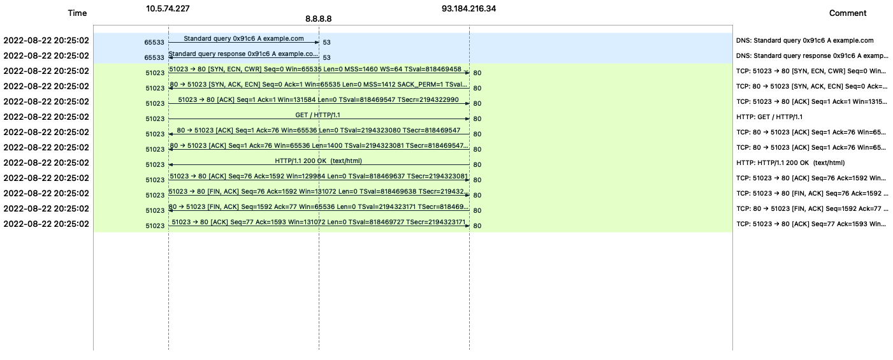

In the next section, we will learn how to create it.

## Creating the Wireshark Flow Graph

Install Wireshark on your favorite Operating System (Mac, Windows, or Linux) and open it.

The initial screen should be like this:

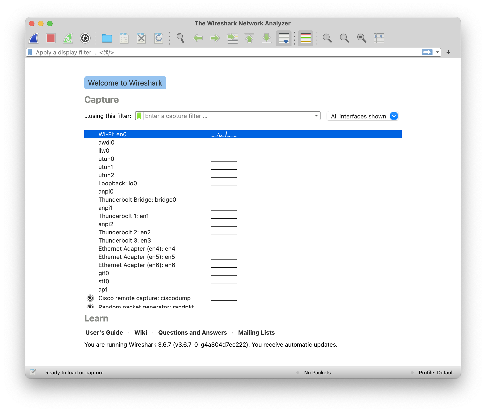

### Preparing the filter

Before capturing traffic, let's find the IP of the domain *www.example.com*.

Open a Terminal or CMD Console and run:

```shell
nslookup www.example.com
```

The answer will look like this:

```shell
Server: 8.8.8.8
Address: 8.8.8.8#53

Non-authoritative answer:
Name: www.example.com
Address: 93.184.216.34
```

The `Server` field indicates the DNS server configured in the environment to which `nslookup` will request to resolve the name `www.example.com`

Find the name under `Non-authoritative answer:` and the IP associated. In the example `93.184.216.34`.

Under *using this filter:* option in the main screen, input:

`tcp port http or port 53 or dst host 93.184.216.34`

`93.184.216.34` is the address resolved with `nslookup`

### Capturing traffic

Select the interface to start capturing network traffic. Usually, it should be the interface where the Packet/s column is constantly changing, which would indicate the presence of live traffic).

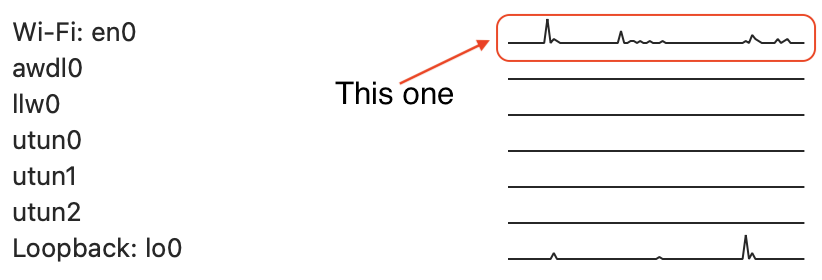

Press the *blue fin* icon to start the traffic capture.

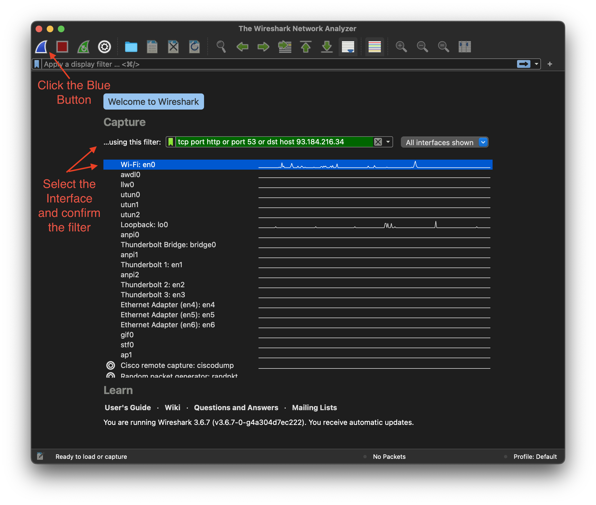

### Request the URL in the Local Client

If you are using Linux or Mac, run the following from a Terminal:

```shell
curl http://example.com
```

From Windows, use Powershell and run:

```powershell
Invoke-WebRequest http://www.example.com
```

Stop capturing traffic by just pressing the big red button. Your screen should look like this:

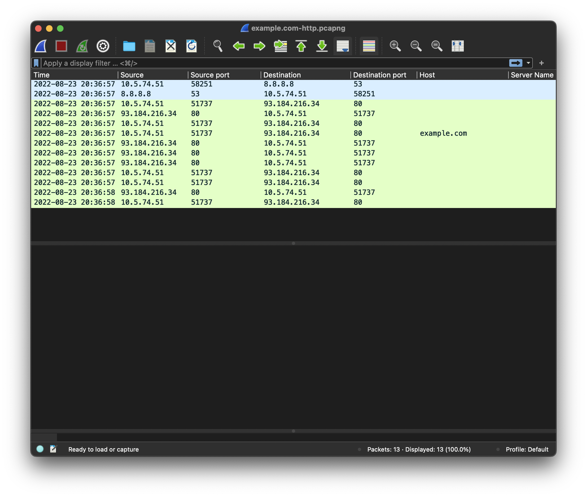

To get the promised Flow Graph, select the *Statistics* menu and *Flow Graph*

## Understanding the captured traffic

Looking at the captured traffic, there are two parts differentiated. The DNS (In *cyan*) and the HTTP (in *green*)

The first line (In *cyan*) shows the DNS request from our IP address to the DNS Server (8.8.8.8 in the example).

The second *cyan* line shows the DNS response. Select it to find the IP Address of the requested domain in the *Packet Details Window*. Under **Domain Name System (Response)** - **Answers** like shown in the image below.

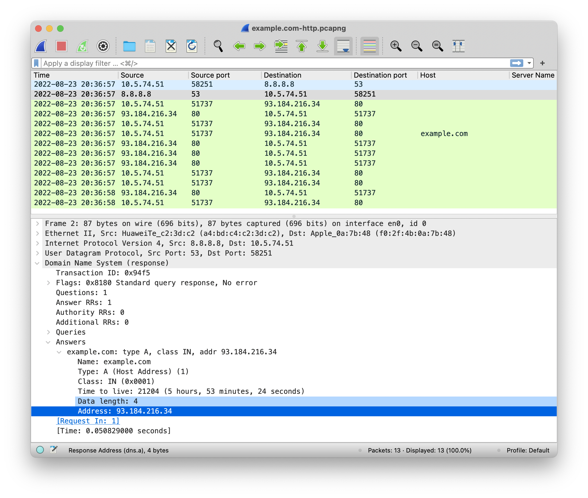

### The 3-Way Handshaking (SYN-ACK)

Found in the following three lines (in *green*).

Before a client and a server can exchange data (payload), they must establish a TCP connection via the TCP 3-way handshake.

**SYN** - The client sends a SYN (Synchronize) packet to the server.
**SYN ACK**- The server sends a SYN-ACK (Synchronize Acknowledge) packet to the client.
**ACK** - The client sends an ACK (Acknowledge) packet to the server.

In the image, it is after the DNS request.

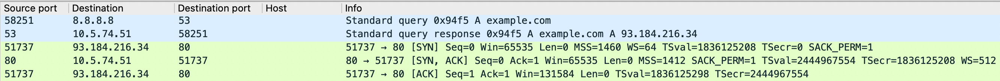

### The Request and Connection Close (FIN ACK)

Next to the SYN-ACK, it comes the HTTP GET and the ACK from the server with the HTTP response.

And finally, the TCP close requests with FIN ACK Packets to close the connection.

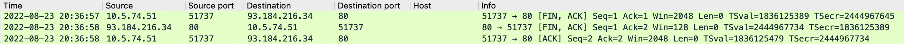

## DNS on Kubernetes

To understand how a *Domain Name* is resolved in a pod, first, let's create a single deployment:

```shell
kubectl create deployment nginx --image nginx
```

To check if the deployment is ready, run:

```shell
kubectl get deployments -o wide
```

```shell
NAME    READY   UP-TO-DATE   AVAILABLE   AGE   CONTAINERS   IMAGES   SELECTOR
nginx   1/1     1            1           26m   nginx        nginx    app=nginx
```

Remember that the DNS resolution inside a container - like any Linux system - is driven by the `/etc/resolv.conf` config file.

```shell
kubectl exec deployments/nginx -- cat /etc/resolv.conf
```

The /etc/resolv.conf file inside the container looks like this by default:

```ini
search default.svc.cluster.local svc.cluster.local cluster.local
nameserver 10.96.0.10
options ndots:5
```

By default, there are three or more search Domains in a Kubernetes configuration. The example above comes from a Minikube Cluster with three local search domains specified.

Look also at the `ndots:5` option. It is important to understand, how both `search` and `ndots` settings work together.

To understand both concepts, refer to the [resolv.conf(5) Linux man page](https://man7.org/linux/man-pages/man5/resolv.conf.5.html)

The `search` represents the search path for a particular domain. Interestingly dev.to or example.com are not FQDN (fully qualified domain name). A standard convention that most DNS resolvers follow is that if a domain ends with a dot (.) (representing the root zone), the domain is FQDN. Some resolvers try to act smart and append the dot (.) themselves. So dev.to. is an FQDN, dev.to is not.

One important point from the [resolv.conf(5) Linux man page](https://man7.org/linux/man-pages/man5/resolv.conf.5.html) For environments with multiple subdomains please read options `ndots:n` to avoid unnecessary traffic for the root-dns-servers. Note that this process may be slow and can generate a lot of network traffic if the servers for the listed domains are not local and that queries will time out if no server is available for one of the domains.

The `ndots` represents the threshold value of the number of dots in a query name to consider it a "fully qualified" domain name.

If `ndots` is **five (5)** (the default in Kubernetes), and the name contains less than five (5) dots inside it, the syscall will try to resolve it sequentially through all local search domains first and - in case none succeed - it will resolve as an absolute name only at last. For instance, the domain name `www.example.com` contains two dots (.) and the number of dots (.) is less than the value of ndots.

Therefore, when this domain name is queried, the DNS query iterates through all search paths until the answer contains a NOERROR code.

1. `www.example.com.<namespace>.svc.cluster.local`
1. `www.google.com.svc.cluster.local`
1. `www.google.cluster.local`
1. `www.google.com`

It is important to remark that A and AAAA records are requested in parallel. The `single-request` option in `/etc/resolv.conf` has a default configuration to perform parallel IPv4 and IPv6 lookups. This option can be disabled using the configuration option `single-request` in the `/etc/resolv.conf` configuration file.

```ini
option single-request
```

## Capturing Traffic in a Kubernetes Pod

There are different ways to capture traffic in a Kubernetes Pod. All the examples are based on the latest Kubernetes functionality using [Ephemeral Debug Containers](https://kubernetes.io/docs/tasks/debug/debug-application/debug-running-pod/#ephemeral-container)

First, let's create a `tcpdump` debug image. Wireshark will use it to display the attached pod traffic. The build process creates multi-platform image to be able to run in `linux/amd64` and `linux/arm64`

### The Dockerfile

```dockerfile
ARG build_for=linux/amd64,linux/arm64
FROM alpine:latest as base

LABEL maintainer="<yourusername>"

# Packages to build image requirements
RUN apk add --no-cache \
    tcpdump

ENTRYPOINT [ "tcpdump" ]
CMD [ "-i", "any" ]
```

### The build command

To create a multi-platform image in *dockerhub* let's create a builder instance and use the extended build capabilities with BuildKit.

```shell
docker buildx create --name buildx --driver-opt network=host --use
docker buildx inspect --bootstrap
docker buildx build -t <yourusername>/tcpdump:v1.0.0 --platform linux/amd64 --platform linux/arm64 --file Dockerfile --push .
docker buildx imagetools inspect <yourusername>/tcpdump:v1.0.0
docker buildx rm buildx
```

The output shows both images with their platforms:

```shell
Name:      docker.io/<yourusername>/tcpdump:v1.0.0
MediaType: application/vnd.docker.distribution.manifest.list.v2+json
Digest:    sha256:9dd8cb1d4b77b7d02d41ff8418cd442c01badfe8ecd0c0a3a58f43f528eba378

Manifests:
  Name:      docker.io/<yourusername>/tcpdump:v1.0.0@sha256:0c341c671566dbc3cdded9da05120bb2216142f46516c14cf3d10b6c38997195
  MediaType: application/vnd.docker.distribution.manifest.v2+json
  Platform:  linux/amd64

  Name:      docker.io/<yourusername>/tcpdump:v1.0.0@sha256:c6de3ab95521c9e7e07a05d99935d19686b8d6e81ab85ce631312cffe57d2ce3
  MediaType: application/vnd.docker.distribution.manifest.v2+json
  Platform:  linux/arm64
```

### Attaching an ephemeral container to the Nginx Pod

Now that the tcpdump image is ready, create an [ephemeral container](https://kubernetes.io/docs/concepts/workloads/pods/ephemeral-containers/) called `debugger`:

```shell
kubectl debug --image imjoseangel/tcpdump:v1.0.0 -c debugger $(kubectl get pod -l app=nginx -o name)
```

### Connecting Wireshark to the ephemeral container

Once created, run Wireshark, and connect it to the just-created container.

```shell
kubectl exec -c debugger deployments/nginx -- tcpdump -s 0 -n -w - -U -i any | Wireshark -kni -
```

### Request the URL from the POD

As in the local machine, do `curl http://example.com` in the Nginx Pod.

```shell
kubectl exec deployments/nginx -c nginx -- curl http://example.com
```

### Analyzing the Traffic

As expected, there are 8 requests to the DNS (A and AAAA) with a negative *No such name* answer for every pair request until reaching the end of the search list and trying with `example.com`

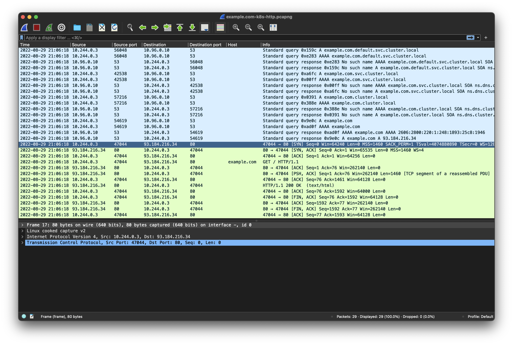

## Why `ndots:5`?

Whe have seen that the value five (5) it generates unnecessary DNS queries. So why five (5) is the default value?

There are two comments in the code that explain why ndots should be five (5) in Kubernetes:

1. [tradeoff between functionality and performance](https://github.com/kubernetes/kubernetes/issues/33554#issuecomment-266251056)
1. [SRV lookup names](https://github.com/kubernetes/kubernetes/blob/v1.2.0/pkg/kubelet/dockertools/manager.go#L65-L68)

The reason why `ndots` is set to five (5) is to allow SRV record lookups to be relative to the cluster's domain.

A typical SRV record has the form `_service._protocol.name.` and in Kubernetes, the name has the form `service.namespace.svc`. The formed record will then look like `_service._protocol.service.namespace.svc`. This query contains four dots. If `ndots` is four (4) it would be considered a FQDN and would fail to resolve. With ndots to five (5), it won't be considered a FQDN and will be searched relative to `cluster.local`.

## Testing the theory with `ndots=4`

Let's see in practice how `ndots=4` behaves with the DNS service.

First, restart the nginx deployment to start from scratch:

```shell
kubectl rollout restart deployment nginx
```

Prepare a file to patch the current deployment with the new `ndots` configuration and apply.

```yaml
---
spec:
  template:
    spec:
      dnsConfig:
        options:
          - name: ndots
            value: '4'
```

```shell
kubectl patch deployments.apps nginx --patch-file ndots-patch.yaml
```

Install `nslookup` in the pod for testing purposes

```shell
kubectl exec deployments/nginx -c nginx -- bash -c "apt-get update && apt-get install dnsutils -y"
```

### Preparing the ephemeral container for ndots testing

Following the same procedure with Wireshark create the [ephemeral container](https://kubernetes.io/docs/concepts/workloads/pods/ephemeral-containers/) called `debugger`:

```shell
kubectl debug --image imjoseangel/tcpdump:v1.0.0 -c debugger $(kubectl get pod -l app=nginx -o name)
```

### Connecting Wireshark for ndots testing

Once created, run Wireshark, and connect it to the just-created container.

```shell
kubectl exec -c debugger deployments/nginx -- tcpdump -s 0 -n -w - -U -i any | Wireshark -kni -
```

### Resolve the DNS Service

Run `nslookup _dns._udp.kube-dns.kube-system.svc` in the Nginx Pod.

```shell
kubectl exec deployments/nginx -c nginx -- nslookup _dns._udp.kube-dns.kube-system.svc
```

In the console, the error is clear:

```shell
** server can't find _dns._udp.kube-dns.kube-system.svc: NXDOMAIN
```

Also in the Wireshark traffic:

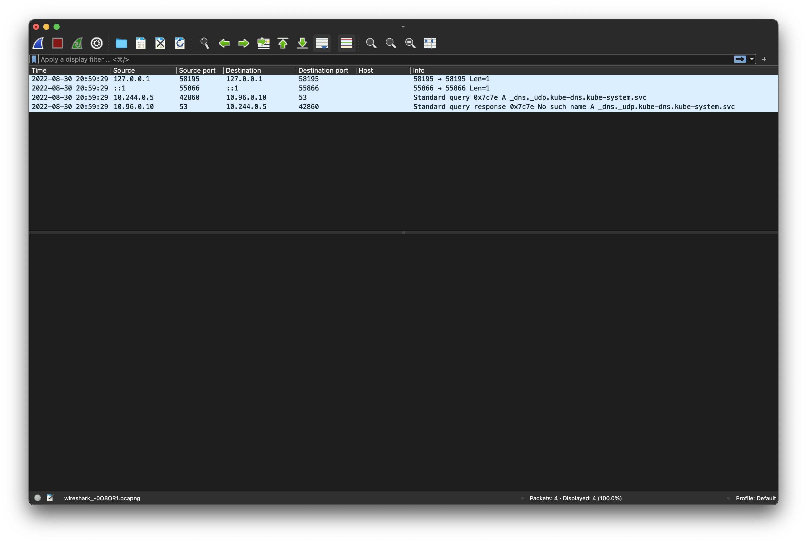

The test with `ndots:5` passes by changing the patch to"

```yaml
---
spec:
  template:
    spec:
      dnsConfig:
        options:
          - name: ndots
            value: '5'
```

Apply the same way:

```shell
kubectl patch deployments.apps nginx --patch-file ndots-patch.yaml
```

Install `nslookup` in the pod for testing purposes

```shell
kubectl exec deployments/nginx -c nginx -- bash -c "apt-get update && apt-get install dnsutils -y"
```

and repeat the process:

```shell
kubectl exec deployments/nginx -c nginx -- nslookup _dns._udp.kube-dns.kube-system.svc
```

Create the [ephemeral container](https://kubernetes.io/docs/concepts/workloads/pods/ephemeral-containers/) called `debugger`:

```shell
kubectl debug --image imjoseangel/tcpdump:v1.0.0 -c debugger $(kubectl get pod -l app=nginx -o name)
```

Launch Wireshark:

```shell
kubectl exec -c debugger deployments/nginx -- tcpdump -s 0 -n -w - -U -i any | Wireshark -kni -
```

And run `nslookup _dns._udp.kube-dns.kube-system.svc` in the Nginx Pod.

```shell
kubectl exec deployments/nginx -c nginx -- nslookup _dns._udp.kube-dns.kube-system.svc
```

The console shows:

```shell
Name:	_dns._udp.kube-dns.kube-system.svc.cluster.local
Address: 10.96.0.10
```

And Wireshark loops properly over DNS `search` until reaching `cluster.local`

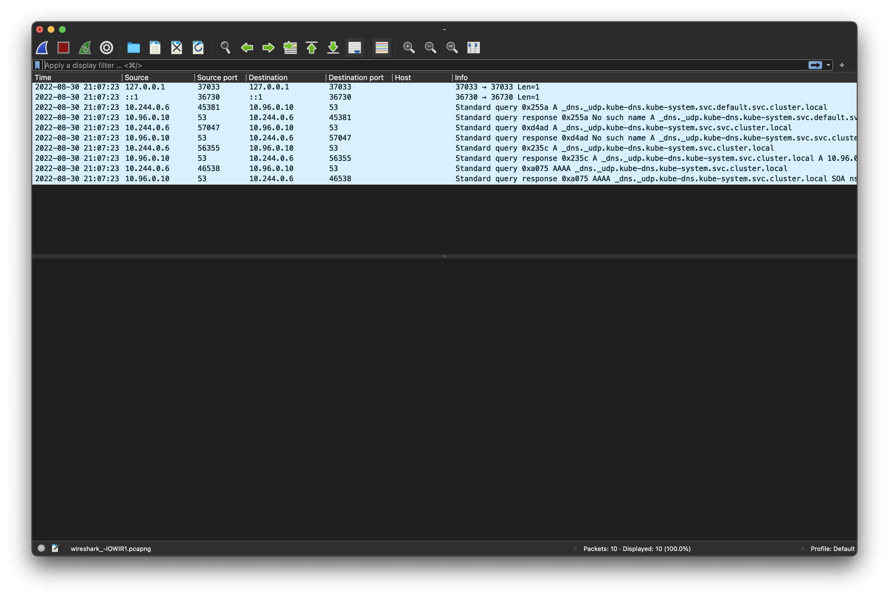

## `ndots:5` can negatively affect to performance

The default `ndots` configuration is perfect for Kubernetes services but shouldn't it be for later deployed microservices.

The Cluster and applications, if connecting with other external components may suffer a negative performance impact and slowness.
