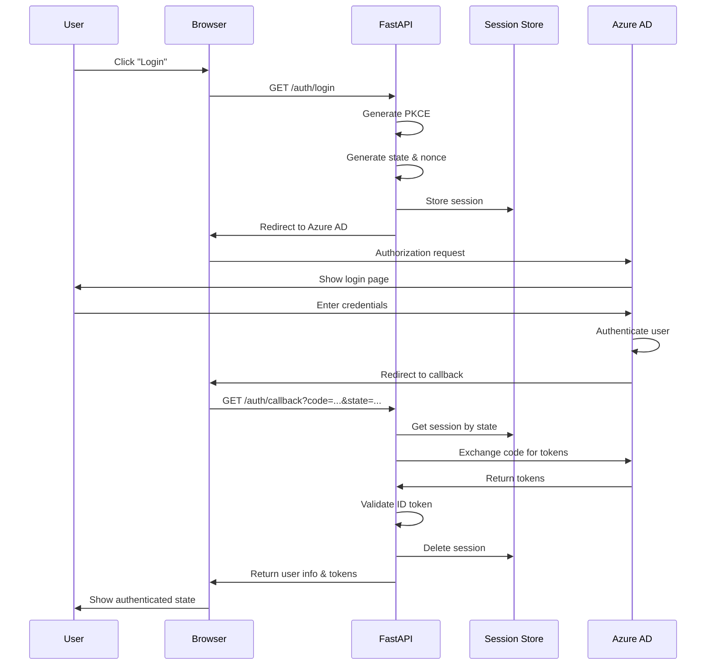
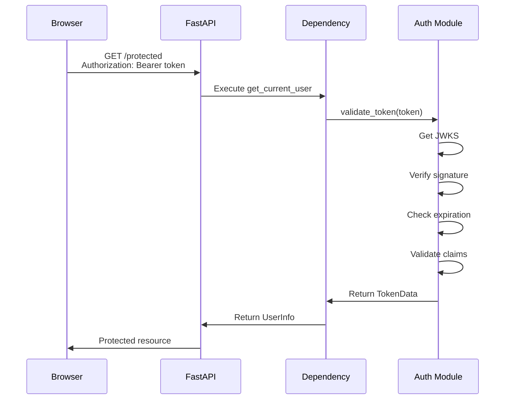

# Azure AD SSO Architecture Guide

## 🏗️ System Architecture

### Overview

This implementation follows a **server-side OAuth2 Authorization Code Flow with PKCE** pattern, ensuring maximum security for both web and SPA applications.

```txt
┌───────────────────────────────────────────────────────────────────┐
│                         CLIENT (Browser)                          │
└───────────────┬───────────────────────────────────────────────────┘
                │
                │ 1. GET /auth/login
                ▼
┌───────────────────────────────────────────────────────────────────┐
│                      FASTAPI BACKEND                              │
│  ┌─────────────────────────────────────────────────────────────┐  │
│  │  2. Generate PKCE Challenge                                 │  │
│  │  3. Store session (state, code_verifier, nonce)             │  │
│  │  4. Build Azure AD authorization URL                        │  │
│  └─────────────────────────────────────────────────────────────┘  │
└───────────────┬───────────────────────────────────────────────────┘
                │
                │ 5. Redirect to Azure AD
                ▼
┌───────────────────────────────────────────────────────────────────┐
│                   AZURE AD / ENTRA ID                             │
│  ┌─────────────────────────────────────────────────────────────┐  │
│  │  6. User authenticates (username/password, MFA, etc.)       │  │
│  │  7. User consents to requested scopes                       │  │
│  │  8. Generate authorization code                             │  │
│  └─────────────────────────────────────────────────────────────┘  │
└───────────────┬───────────────────────────────────────────────────┘
                │
                │ 9. Redirect to callback with code
                ▼
┌───────────────────────────────────────────────────────────────────┐
│                      FASTAPI BACKEND                              │
│  ┌─────────────────────────────────────────────────────────────┐  │
│  │  10. Validate state (CSRF protection)                       │  │
│  │  11. Retrieve code_verifier from session                    │  │
│  │  12. Exchange code + verifier for tokens                    │  │
│  │  13. Validate ID token (JWT signature, issuer, audience)    │  │
│  │  14. Extract user information                               │  │
│  │  15. Clean up session                                       │  │
│  └─────────────────────────────────────────────────────────────┘  │
└───────────────┬───────────────────────────────────────────────────┘
                │
                │ 16. Return tokens to client
                ▼
┌───────────────────────────────────────────────────────────────────┐
│                         CLIENT (Browser)                          │
│  ┌─────────────────────────────────────────────────────────────┐  │
│  │  17. Store access token (sessionStorage recommended)        │  │
│  │  18. Include token in Authorization header for API calls    │  │
│  └─────────────────────────────────────────────────────────────┘  │
└───────────────────────────────────────────────────────────────────┘
```

## 🔐 Security Components

### 1. PKCE (Proof Key for Code Exchange)

**Purpose**: Prevent authorization code interception attacks

**How it works**:

1. **Code Verifier**: Random 43-128 character string
2. **Code Challenge**: SHA256 hash of code verifier (Base64URL encoded)
3. **Flow**:
   - Send code_challenge with authorization request
   - Send code_verifier with token request
   - Azure AD validates: SHA256(code_verifier) == code_challenge

**Implementation**:

```python
# Generation (src/auth.py)
code_verifier = base64.urlsafe_b64encode(os.urandom(32))
code_challenge = base64.urlsafe_b64encode(
    hashlib.sha256(code_verifier).digest()
)
```

### 2. State Parameter (CSRF Protection)

**Purpose**: Prevent Cross-Site Request Forgery attacks

**How it works**:

1. Generate random state before redirect
2. Store in server-side session
3. Validate state in callback matches stored value
4. Delete session after validation

**Implementation**:

```python
# Generation
state = secrets.token_urlsafe(32)

# Storage
await session_manager.create_session(state=state, ...)

# Validation
session_data = await session_manager.get_session(state)
if not session_data:
    raise HTTPException(400, "Invalid state")
```

### 3. JWT Token Validation

**Purpose**: Verify token authenticity and integrity

**Validation steps**:

1. **Signature verification**: Using Azure AD public key (JWKS)
2. **Issuer validation**: Matches expected Azure AD tenant
3. **Audience validation**: Matches application client ID
4. **Expiration check**: Token not expired
5. **Algorithm check**: Only RS256 allowed

**Implementation**:

```python
# Get public key from JWKS
jwks = get_jwks()
rsa_key = find_matching_key(jwks, token_header)
public_key = convert_to_pem(rsa_key)

# Decode and validate
payload = jwt.decode(
    token,
    public_key,
    algorithms=["RS256"],
    audience=CLIENT_ID,
    issuer=EXPECTED_ISSUER
)
```

### 4. Session Management

**Development**: In-memory storage (not persistent)
**Production**: Redis storage (scalable, persistent)

**Session data includes**:

- State parameter
- PKCE code verifier
- Nonce (for ID token validation)
- Original redirect URI
- TTL: 10 minutes (configurable)

## 📦 Component Breakdown

### Configuration Layer (`config.py`)

**Purpose**: Centralized configuration management

**Key features**:

- Environment-based settings
- Type validation with Pydantic
- Derived properties (URLs, endpoints)
- Secret management

**Best practices**:

```python
# ✅ Use environment variables
settings = get_settings()

# ✅ Leverage derived properties
auth_url = settings.authorize_endpoint  # Auto-constructed

# ❌ Don't hardcode
# auth_url = f"https://login.microsoftonline.com/{tenant}/..."
```

### Authentication Layer (`auth.py`)

**Purpose**: Core Azure AD integration logic

**Responsibilities**:

- PKCE generation
- Token validation (JWT)
- JWKS caching (24 hours)
- URL construction
- User info extraction

**Key methods**:

- `generate_pkce_challenge()`: Create PKCE pair
- `validate_token()`: Verify JWT
- `build_authorization_url()`: Construct login URL
- `extract_user_info()`: Parse token claims

### OAuth2 Client (`oauth2_client.py`)

**Purpose**: Handle token exchange with Azure AD

**Responsibilities**:

- Exchange authorization code for tokens
- Refresh access tokens
- Call Microsoft Graph API
- Error handling

**Flow**:

```python
# Code exchange
tokens = await oauth_client.exchange_code_for_tokens(
    code=auth_code,
    redirect_uri=callback_uri,
    code_verifier=pkce_verifier
)

# Token refresh
new_tokens = await oauth_client.refresh_access_token(
    refresh_token=old_refresh_token
)
```

### Dependencies (`dependencies.py`)

**Purpose**: FastAPI dependency injection for auth

**Key dependencies**:

1. **`get_current_user`**: Require valid authentication

   ```python
   async def protected_route(user: UserInfo = Depends(get_current_user)):
       return {"user_id": user.id}
   ```

2. **`require_roles`**: Require specific roles

   ```python
   @app.get("/admin")
   async def admin_route(user: UserInfo = Depends(require_roles("Admin"))):
       return {"admin_data": ...}
   ```

3. **`require_groups`**: Require group membership

   ```python
   @app.get("/finance")
   async def finance_route(user: UserInfo = Depends(require_groups("Finance"))):
       return {"reports": ...}
   ```

4. **`require_tenant`**: Multi-tenant isolation

   ```python
   @app.get("/tenant-data")
   async def tenant_route(user: UserInfo = Depends(require_tenant("tenant-1"))):
       return {"data": ...}
   ```

## 🔄 Authentication Flow Details

### Login Flow



### Protected API Call



## 🎯 Design Decisions

### Why Server-Side Flow?

**Advantages**:

- ✅ Client secret protected (not exposed to browser)
- ✅ Better security for token storage
- ✅ Easier to implement refresh logic
- ✅ Centralized session management

**vs. Client-Side (SPA) Flow**:

- ❌ Can't use client secret safely
- ❌ Tokens stored in browser (more vulnerable)
- ❌ Complex PKCE implementation

### Why PKCE Even with Client Secret?

**Defense in depth**:

- Protects against authorization code interception
- Required for public clients (mobile, SPA)
- Recommended by OAuth 2.0 Security Best Practices
- No downside to using it

### Why Redis for Sessions?

**Benefits**:

- ✅ Horizontal scaling (multiple API instances)
- ✅ Persistent storage (survives restarts)
- ✅ Automatic expiration (TTL)
- ✅ High performance

**Alternatives**:

- In-memory: Development only
- Database: Slower, needs cleanup job
- Distributed cache: Redis is simpler

## 🚀 Deployment Considerations

### Single Instance

```yaml
# Simple deployment
uvicorn src.main:app --host 0.0.0.0 --port 8000
```

**Session storage**: In-memory or Redis

### Multiple Instances (Load Balanced)

```yaml
# docker-compose.yml
services:
  api:
    replicas: 3
  redis:
    image: redis:7-alpine
```

**Required**: Redis for shared sessions

### Kubernetes

```yaml
apiVersion: apps/v1
kind: Deployment
metadata:
  name: fastapi-sso
spec:
  replicas: 3
  template:
    spec:
      containers:
      - name: api
        env:
        - name: REDIS_HOST
          value: redis-service
```

## 🔧 Customization Points

### 1. Add Custom Claims to Tokens

```python
# In Azure AD App Registration
# Token Configuration → Add optional claims
# API receives them in JWT payload
```

### 2. Implement Role Mapping

```python
# Map Azure AD roles to application roles
def map_roles(azure_roles: list[str]) -> list[str]:
    role_mapping = {
        "Global Administrator": "Admin",
        "User Administrator": "UserManager"
    }
    return [role_mapping.get(r, r) for r in azure_roles]
```

### 3. Add Custom Scopes

```python
# Request additional Microsoft Graph scopes
AZURE_SCOPES = "openid profile email User.Read Mail.Read Calendar.Read"
```

### 4. Implement Token Caching

```python
# Cache validated tokens to reduce JWKS lookups
@lru_cache(maxsize=1000)
def validate_cached_token(token_hash: str):
    # Validation logic
    pass
```

## 📊 Monitoring & Observability

### Key Metrics to Track

1. **Authentication success rate**
2. **Token validation failures**
3. **Session store latency**
4. **JWKS cache hit rate**
5. **Failed login attempts**

### Logging Strategy

```python
# Structured logging
logger.info(
    "User authenticated",
    extra={
        "user_id": user.id,
        "tenant_id": user.tenant_id,
        "event": "auth_success"
    }
)
```

---

This architecture provides a **solid foundation** for enterprise SSO with Azure AD. It's **secure, scalable, and maintainable** while following industry best practices.
